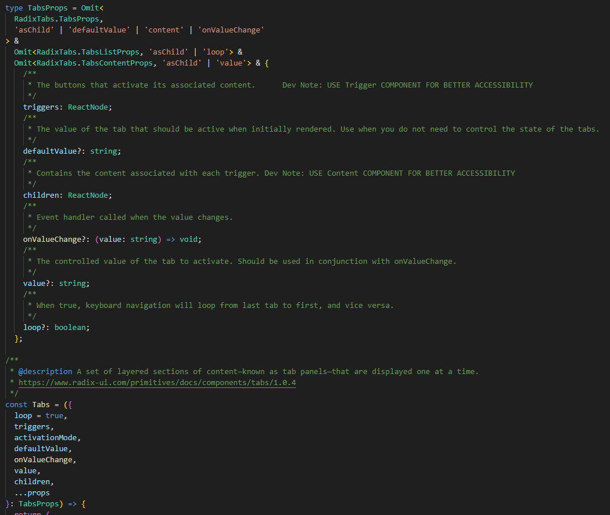

# Getting started with the Platform Enablement Team

dev-launchers-platform is a mono repo using yarn. All yarn script lines need to be run in the root folder. 

## Installing and quick started
1. install yarn, below are several ways to install. 
    - In a terminal with admin run ```$ corepack enable```
    - ```$ npm install --global yarn```

2. clone the repo @  https://github.com/dev-launchers/dev-launchers-platform
3. After cloning repo, navigate to /dev-launchers-platform
4. ```$ yarn install``` in the root folder to install dependencies 
5. Open a new terminal and run ```$ yarn workspace @devlaunchers/tailwind dev```. to start tailwind constructor.
5. Open a 2nd terminal and run ```$ yarn workspace @devlaunchers/components storybook``` to start storybook.
7. Start Development work.

### Yarn scripts for this team

```
$ yarn workspace @devlaunchers/tailwind dev
$ yarn workspace @devlaunchers/components storybook
$ yarn workspace @devlaunchers/components typecheck
```
More scripts are located in the package.json file. 

### Installing packages

To install a package into a specific workspace:

    $ yarn workspace @devlaunchers/<workspace> add <library>

#### Installing Radix-ui components

Radix-ui components need to be installed individually, if you are not able to import @radix-ui follow the command below to install in devlaunchers components workspace.

    $ yarn workspace @devlaunchers/components add <library>

Below is the command to install radix-ui/react-checkbox

    $ yarn workspace @devlaunchers/components add @radix-ui/react-checkbox


# Boards and issues.

### Issues in github

When looking at issues in github, you will want to filter by Platform Enablement. 

https://github.com/dev-launchers/dev-launchers-platform/issues?q=is%3Aopen+is%3Aissue+label%3A%22Platform+Enablement%22

### Zenhub

Platform Enablement Team uses zenhub as it's board. If this link does not work msg lead to invite you to the team.

https://app.zenhub.com/workspaces/platform-enablement-63529f02029ee50018fe58c6/board

## Git branch checkout flow

We will be working out of development/components. 

    $ git checkout development/components

- after switching to the development/components branch, make sure you "yarn install" for new dependencies

### Out of "development/components" branch all new branches will be created off of it.

    $ git checkout -b components/newBranchName


## Figma

Go to universal Figma @:

    https://www.figma.com/file/EwzuhhvTulvFRMvhTD5VAh/DL-Universal-Design-System?type=design&t=w1PSPgQunxcd19Bz-6

- All component designs will be coming from the universal UI library.
- Make sure dev mode is toggled in Figma.
- All tailwind classes will be made up of dashes, other characters like '/' will be replaced with '-'.

## Vscode extensions

```extensions.json``` in this workspace will recommend the follow extensions when you first open the workspace:

1. Tailwind css intellisense
2. Eslint
3. ES7 + React/redux/React-native snippets.
4. Figma for vs code


### Storybook snippet

By typing "story" in an empty file, you can get the below snippet as a starter for storybook files. When thes snippet is imported it will have selected all the parts needs to type in your Component.

```
import type { Meta, StoryObj } from '@storybook/react';

import Component from './Component';

const meta: Meta<typeof Component> = {
  component: Component,
};

export default meta;
type Story = StoryObj<typeof Component>;

/*
 *👇 Render functions are a framework specific feature to allow you control on how the component renders.
 * See https://storybook.js.org/docs/react/api/csf
 * to learn how to use render functions.
 */
export const Primary: Story = {
  render: () => <Component />,
};
```

## Storybook & tailwind dev environment. 

In a terminal, in order to get tailwind classes in your project you will need to run the dev command.

    $ yarn workspace @devlaunchers/tailwind dev

Storybook will be the primary way you will see your design changes. Running "components storybook" this is open up a browser for storybook. This is where you can see changes that are made. By running the command below, a window should open with storybook running.

    $ yarn workspace @devlaunchers/components storybook


## Creating new components in project.

When creating the folder/files in src/components :

- The Project Components folder should match the Figma design location 
    - Example "src/components/Checkbox"
- Project Components names should match the design Name - "Capitalized"
    - Example "src/components/Checkbox/Checkbox.tsx"
- Project components need a #.stories.tsx to work with storybook.
  - find a template or copy from another stories.tsx
- Create an index.ts file for exporting the tsx files. 
    ```
    export { default as Alert } from './Alert';
    export type {AlertProp} from './Alert'
    ```


## Adding assets

For .tsx assets check the need too re-export all components into an index.ts for exporting in the folder that it is living in.
 
```
packages/UI/src/assets/icons/index.ts
```


## Jsdocs auto intergration with storybook.

Attempt to put all documentation via jsdocs. Storybook will auto import depending on the location of the jsdocs. Make it so documenation is only in one location in code, and both storybook and jsdocs draw from the same location. 

As a example - Tabs story in storybook will grab this jsdocs, at the same time it will be shown by a description in mouse hover. 



## Submit the branch with a new pull request.

In git bash, you will want to do the git push flow.

  - git add .
  - Git commit -m "describes what you worked on"
  - git push origin branch

Go to github.com and make sure you are logged in and in the right repo.
https://github.com/dev-launchers/dev-launchers-platform

  - Go to "Pull Requests" tab.
  - Create new "Pull request"
  - the base branch is "development/components"
  - the compare branch is your new branch
  - Rest on technical lead to merge or give feedback.
